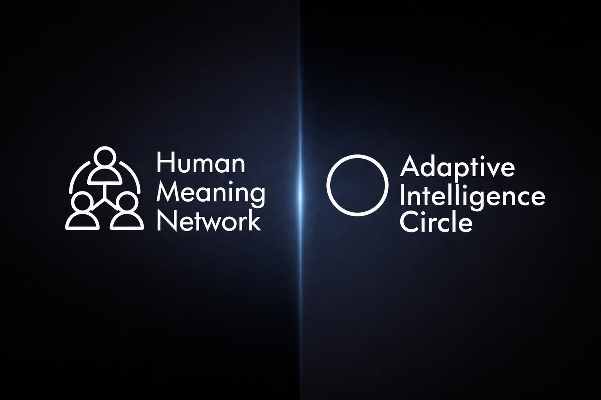

<!-- <h1 align="center">
   
  Nguyen Duc Tri
</h1> -->

<h1 align="center">
   
  Nguyen Duc Tri
</h1>

<h3 align="center">Founder of Adaptive Intelligence Circle (AIC) and Human Meaning Network (HMN) </h3>
<h4 align="center">Lead Architect of Adaptive AI • Adaptive OS • IBCS • DIP • AIForDriver</h4>

  

---

## 🌐 About Me
> *“Technology should not only adapt to humans — it should evolve with human ethics and responsibility.”*

- 🎯 **Founder** of [Adaptive Intelligence Circle (AIC)](https://github.com/AdaptiveIntelligenceCircle) — an open, global, and ethical intelligence initiative.
- 🧠 Research focus: **Adaptive AI Systems**, **Kernel-level Security**, **Distributed Reasoning Frameworks**.
- 🧩 Creator of:
  - **Adaptive AI** — self-learning, self-defensive intelligence engine  
  - **Adaptive OS** — decentralized protection and orchestration system  
  - **IBCS** — introspective behavioral compiler system  
  - **AIForDriver** — real-world adaptive intelligence  
  - **Driver Introspective Proxy** - Kernel space intelligence. 
  - **AICP** - Protocol for Adaptive Intelligence Circle.
  - **AIC-Agents/EdgeOS/Earth/DePin/Orchestration/AeroSpace**
  - **AIC-Governance/Education/Energy/Creative/Sports/Quantum/Heath**

- 🌍 Based in Vietnam • Leading a human-centered revolution in intelligence

- 🎯 **MY ORCID** : https://orcid.org/0009-0007-8545-0420
- 🎯 **Open Collective (Nguyen Duc Tri)** : https://opencollective.com/dashboard/nguyen-duc-tri
- 🎯 **Open Collective (AIC)**: https://opencollective.com/adaptive-intelligence-circle#category-CONNECT
- **GitLab**: https://gitlab.com/users/CodelikeC
- **CodeBerg**: https://codeberg.org/NguyenDucTri_2004-AIC
- **Substack**:https://substack.com/@nguynctr1
- **Spiderum**: https://spiderum.com/nguoi-dung/TrifanboymarvelDc

---

## 🧭 Vision & Philosophy
> Building **root-level adaptive intelligence** that unites engineering discipline, ethical responsibility, and humanistic design.

- 🔁 AIC stands for: **Autonomy • Integrity • Collaboration**  
- ⚙️ My core belief:  
  *“Complexity with purpose is better than simplicity without soul.”*

---

## 🕰️ Mission Timeline

| Year | Milestone | Description |
|------|------------|-------------|
| **4/2025** | **Adaptive AI** | Initiated research on self-adaptive architecture & meta-learning core |
| **5/2025** | **Adaptive OS** | Designed kernel-level adaptive system & plugin infrastructure |
| **7/2025** | **IBCS** | Built the Introspective Behavioral Compiler System (Language + Runtime) |
| **8/2025** | **DIP** | Built the Driver Introspective Proxy (Kernel + Runtime + adaptive AI prototype) |
| **9/2025 (Q3)** | **AIForDriver** | Applied adaptive models in real-time autonomous systems |
| **11/2025 (Q4)** | **AIC Global Phase** | Foundation of *Adaptive Intelligence Circle* as an ethical AI movement |
| **1/2026** | **Adaptive Intelligence Network (AIN)** | Decentralized, ethical intelligence ecosystem beyond OS level |
| **1/2026 - Future** | **Human Meaning Network (HMN)** | Decentralized, non-profit network based on AIN – designed to help people discover, share, and maintain their personal meaning in a post-scarcity context |

---

## 🧩 Core Projects

| Repository | Description | Focus |
|-------------|--------------|--------|
| [Adaptive AI](https://github.com/AdaptiveIntelligenceCircle/AdaptiveAI) | Context-aware, self-learning meta architecture | Intelligence Core |
| [Adaptive OS](https://github.com/AdaptiveIntelligenceCircle/AdaptiveOS) | Decentralized, kernel-level adaptive operating system | Systems & Security |
| [IBCS](https://github.com/AdaptiveIntelligenceCircle/IBCS) | Introspective Behavioral Compiler System | Language + Reasoning |
| [AIForDriver](https://github.com/AdaptiveIntelligenceCircle/AIForDriver) | Adaptive intelligence for real-world autonomous control | Applied AI |
| [Driver Introspective Proxy](https://github.com/AdaptiveIntelligenceCircle/DriverInstrospectiveProxy) | Adaptive intelligence for kernel/Driver system autonomous control | Applied AI |
---

## 🎙️ Featured Talks / Media

> *Official Podcast Launch — 11/11/2025*

| Title | Platform | Description |
|--------|------------|-------------|
| **This AI Operating System is teaching technology to think ethically** | 🎧 *Apple Podcast Series by Dr.Tamara Nall* | A deep dive into the vision, ethics, and mission behind AIC |
| **From Open Source to Adaptive Systems** | 🗣️ *Community Talk* | Sharing how zero-capital innovation can shape ethical technology |
| **Building Adaptive OS for Humanity** | 📺 *FutureTech Asia 2026 (planned)* | Bridging AI, security, and humanistic engineering principles |

---

## 🛠️ Languages & Technologies

  

---

## 📊 Stats & Highlights

  
  

  
  

---

## 🤝 Connect with Me

  
  
  
  

---

  <i>“The revolution of intelligence begins not from machines — but from the human behind them.”</i> 
  <b>— Nguyen Duc Tri, Founder of AIC</b>

