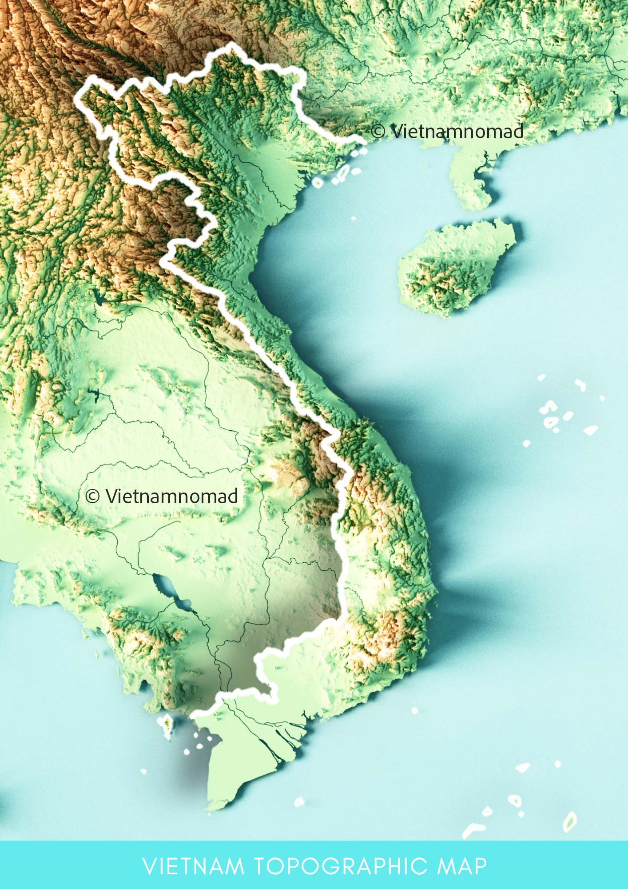
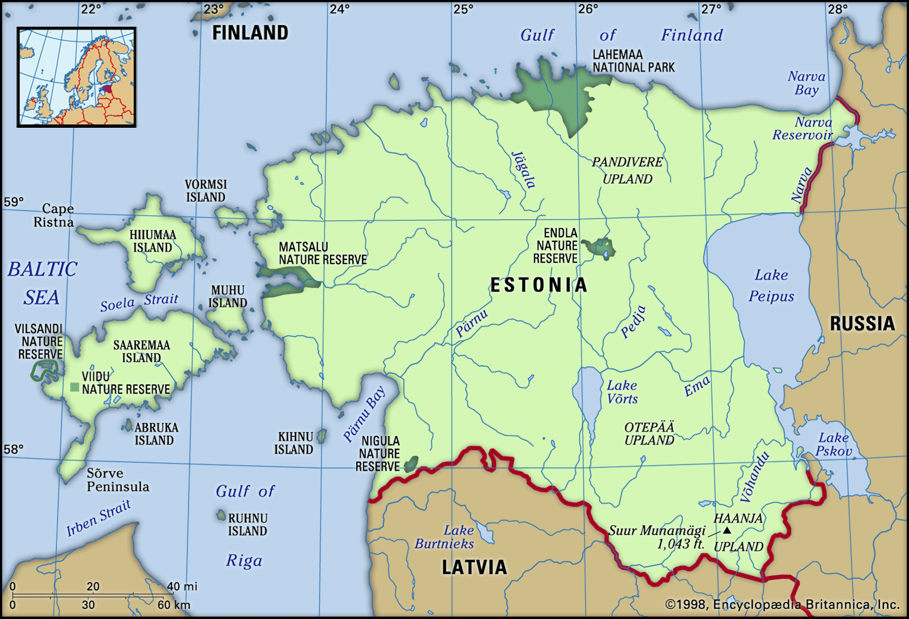

<!-- <h1 align="center">
   
  Nguyen Duc Tri
</h1> -->

<h1 align="center">
   
  Nguyen Duc Tri
</h1>

<h3 align="center">Founder/Chief Architect of Adaptive Intelligence Circle (AIC) and Human Meaning Network (HMN) </h3>
<h4 align="center">Represent the ECP philosophy: Ethical Civilizational Protocol </h4>
<h4 align="center"> Global South and EU (Estonia) Independent Non-Profit Organization </h4>

  
  

  

---

## 🌐 2004 | OVERVIEW
> *“Technology should not only adapt to humans — it should evolve with human ethics and responsibility.”*

- 🎯[Adaptive Intelligence Circle (AIC)](https://github.com/AdaptiveIntelligenceCircle) — an open, global, and ethical intelligence initiative.
<!-- - 🧠 Research focus: **Adaptive AI Systems**, **Kernel-level Security**, **Distributed Reasoning Frameworks**.
- 🧩 Creator of ~ 40 repositories: 
  - **Adaptive AI** — self-learning, self-defensive intelligence engine  
  - **Adaptive OS** — decentralized protection and orchestration system  
  - **IBCS** — introspective behavioral compiler system  
  - **AIForDriver** — real-world adaptive intelligence  
  - **Driver Introspective Proxy** - Kernel space intelligence. 
  - **AICP** - Protocol for Adaptive Intelligence Circle.
  - **AIC-Agents/EdgeOS/Earth/DePin/Orchestration/AeroSpace**
  - **AIC-Governance/Education/Energy/Creative/Sports/Quantum/Heath**
  - **Human Meaning Network** and **other significant projects**

- 🌍 Started at 20 years 8 months 10 days by Vietnamese independent Founder • Leading a human-centered revolution in intelligence -->

 Nguyen Duc Tri, born August 18, 2004, is a Vietnamese programmer and independent technology founder. He developed Adaptive Intelligence Circle – a multi-layered civilization restructuring protocol that emerged in April 2025. It is the culmination of over 40 open repositories as of July 2026 and aims for the innovate, fundamental revolution in technology and humanitarian values. At the age of 20 years and 8 months 10 days, he is one of the youngest (possibly the youngest) people in Vietnam and the world to implement a long-term vision through a multi-layered civilization protocol from Global South. He is currently a final-year student at HUST and a TechUp Fellow at The IO Foundation. 

Throughout his career, he applied for a software engineer and AI tutor position at xAI (now merged with SpaceX) in July 2025, and was invited to apply for an AI data training position at Invisible Technologies in April 2026. In the same year, he is currently participating in FlyRank AI as an AI Fluency intern. Known for his independent thinking and strong technical skills, he has bet on a future architecture based on Ethical From Kernel, Third Path Absolute, and Zero Donation. He has designed and maintained this system as a multi-tiered and distributed structure, inspired by pioneering founders and deeply expanding the scope of technological history. This work aims for a sustainable, flexible, transparent, selective, and independent ecosystem. In March 2026, he had the honor of participating in an online meeting with United Nations Institute for Training and Research (UNITAR) – as an informal senior advisor.

The Adaptive Intelligence Circle is now present on multiple platforms such as Github, Open Collective, Codeberg, GitLab, YouTube, LinkedIn, Reddit, Substack and Apple Podcast with LeadWithAI (#1 Tech), and has received positive reception from the open-source community as well as attention from major institutions – xAI, Amazon, Meta, Polarity, Invisible Technologies, Alibaba, Forge, Triple AI, FlyRank AI, The IO Foundation – due to its systematic approach and potential to open a new path in the increasingly fierce AI competition of the 21st century.

- 🎯 **MY ORCID** : [NguyenDucTri](https://orcid.org/0009-0007-8545-0420)
- 🎯 **Open Collective (Nguyen Duc Tri)** : [OpenCollective/NguyenDucTri](https://opencollective.com/dashboard/nguyen-duc-tri)
- 🎯 **Open Collective (AIC)**: [OpenCollective/AIC](https://opencollective.com/adaptive-intelligence-circle#category-CONNECT)
- **GitLab**: [GitLab/CodelikeC](https://gitlab.com/users/CodelikeC)
- **CodeBerg**: [NguyenDuctri_AIC](https://codeberg.org/NguyenDucTri_2004-AIC)
- **Substack**:https://substack.com/@nguynctr1
- **Website**: [Linkedin/AdaptiveIntelligenceCircle](https://www.linkedin.com/company/112400906/admin/page-posts/published/)
- **Youtube**: [@AdaptiveIntelligenceCircle](https://www.youtube.com/channel/UCFqAmuzpH0mrENjoAfGAj2A)
---

## 🧭 Vision & Philosophy
> Building **root-level adaptive intelligence** that unites engineering discipline, ethical responsibility, and humanistic design.

- 🔁 AIC stands for: **Autonomy • Integrity • Collaboration**  
- ⚙️ My core belief:  
  *“Complexity with purpose is better than simplicity without soul.”*

---

## 🎓 Education

- **Troy University** – Bachelor’s Program  
  Joint program with Hanoi University of Science and Technology [2022-2027]  

- **Activities and societies:** 
> •  International dual-degree program delivered in collaboration with HUST and Troy University (USA).

> •  Focused on Artificial Intelligence, Computer Engineering, Ethics, Philosophy and Human-Centered System.

> •  Founder of Adaptive Intelligence Circle (AIC) - Non Profit organization recognized by international institutions. At 20 years 8 months, became the first student in the Troy-HUST program and in Vietnam to initiate a multi-layer civilization protocol from the Global South.

> •  General AI Fluency @FlyRank AI

--- 

## 🏆 Experience

- **[Project Manager]** – [**Open Collective**]  
  [Dec 2025] – [Present]  

  > Managing the AIC project’s funding and community contributions through Open Collective. Overseeing transparency, budgeting, and contributor engagement as part of the ecosystem’s governance.

- **[TechUP Fellowship]** - [**The IO Foundation**] 

  [July 2026] - [present]

  > + Selected as a Fellow for the TechUp program in collaboration with IETF 126.
 
  > + Representing Adaptive Intelligence Circle (AIC) to engage with global standards development in internet protocols, ethical AI governance, and decentralized systems.
 
  > + Contributing perspectives from the Global South on building trustworthy, human-centered digital infrastructure

- **[Open Source Developer]** – [**GitHub Inc**]  
  [Mar 2024] – [Present]  

  > Leading the development and governance of AIC and HMN projects, hosted on GitHub. Responsibilities include designing architecture, managing repositories, coordinating contributors, and ensuring transparency in open-source collaboration.

- **[Guest Speaker]** – [**The Leading Niche**]  
  [Oct 2025] – [Nov 2025]  

  > I join an Apple podcast named LeadWithAI. The host is Dr. Tamara with 25 years of experience in AI platform for business. The podcast was launched in November 2025 on multiple media : YouTube, Apple Podcast, Instagram, LinkedIn,..

  > We talk about the mission behind AIC : a non-profit open source organization of Ethical AI planetary and decentralized system.

- **[Technical Assessment Candidate]** - [**xAI** (merge with **SpaceX**)]

  [July 2025] - [July 2025]

  > Advanced to Round 2 in competitive hiring process for Software Engineering and AI Tutor roles. 
  > Demonstrated expertise in programming, AI system. Attached Data Structure and problem solving. 
  > Gained valuable insights into frontier AI research priorities and team dynamics at a leading AI organization.

- **[High-Level Informal Consultation]** - [**United Nations**]

  [March 2026] - [present]

  > Participated in a strategic interview session hosted by UNITAR, sharing insights as the Founder of Adaptive Intelligence Circle (AIC). Contributed perspectives on AI innovation, ethical leadership, and youth empowerment in global digital transformation. The session aimed to explore collaborative opportunities between UNITAR and emerging tech leaders.

- **[Member of Expert Marketplace AI engineer]** - [**Invisible Technologies**]
  
  [May 2026] - [end]

  > Selected as a member of the Invisible Marketplace after completing assessment.  
  > Engaged in freelance opportunities matching skills in [AI research / writing / analysis / etc.].  
  >Contributing to projects with focus on ethics, narrative building, or other strengths.  

- **[AI internship]** - [**FlyRank AI**]

  [June 2026] - [present]

  > Currently interning at FlyRank AI as an AI intern, focusing on General AI Fluency.
--- 

## 🕰️ Mission Timeline

| Year | Milestone | Description |
|------|------------|-------------|
| **4/2025** | **Adaptive AI** | Initiated research on self-adaptive architecture & meta-learning core |
| **5/2025** | **Adaptive OS** | Designed kernel-level adaptive system & plugin infrastructure |
| **7/2025** | **IBCS** | Built the Introspective Behavioral Compiler System (Language + Runtime) |
| **8/2025** | **DIP** | Built the Driver Introspective Proxy (Kernel + Runtime + adaptive AI prototype) |
| **9/2025** | **AIForDriver** | Applied adaptive models in real-time autonomous systems |
| **10/2025 - 11/2025** | **Appearance in Apple Podcast** | AIC first made its public debut in October, when the founder participated in a podcast called LeadWithAI by Dr. Tamara Nall, who has years of experience in AI development. We talked about Adaptive OS and it was announced on various social media platforms such as Apple, YouTube, Instagram, TikTok, LinkedIn, etc. This is a big step forward since April 2025.|
| **11/2025-12/2025**| **Professional Development**| I believe AIC needs a decentralized platform or a transparent network that can establish legal status. I think Europe is an interesting location for Global South, especially given its extremely strict legal framework for open projects. This presents both an opportunity and a challenge for AIC's vision.|
| **12/2025- 1/2026** | **AIC is planned to global** | Since successfully listing the NPO on Open Collective, I've expanded AIC's concept into a complete ecosystem with a demo CLI. AIC went from 6 repositories to an entity with over 30 repos. This was a very fast-paced but necessary phase to keep up with the vision. I introduced a new concept called the Human Meaning Network – addressing the crisis of consciousness, infrastructure, and human existence in the next stage of civilization. This was a difficult but inevitable step as it moved AIC from an AI protocol toward restructuring the intelligence infrastructure towards a distributed and transparent ethical approach. |
| **1/2026 - 6/2026** | **Phase II** | After January 2026, AIC began to attract attention from major institutions such as xAI, UNITAR, Invisible Technologies, and Polarity as a strategic asset in global technology. Originating from Vietnam with a different vision, I was honored to meet with UNITAR's director, Mr. Fengping Wu, as an unofficial senior advisor, and Polarity's founder, Shane Barakat, when discussing technical cooperation terms via KeyStone. Additionally, Amazon was another notable name, accessing AIC's source code on Github and my initial videos on YouTube. The pressure is mounting. The next steps in this phase are TestNet and Whitepaper. |
| **7/2026** | **Fiscal Host, Whitepaper Draft and preparing TestNet** | Complete the governance and first experiement of Adaptive Intelligence Circle before goes to public |
| **Future** | **Ethical Field** | Decentralized, non-profit network based on AIC – designed to help people discover, share, and maintain their personal meaning in a post-scarcity context |

---

## 🧩 Core Projects

| Repository | Description | Focus |
|-------------|--------------|--------|
| [Adaptive AI](https://github.com/AdaptiveIntelligenceCircle/AdaptiveAI) | Context-aware, self-learning meta architecture | Intelligence Core |
| [Adaptive OS](https://github.com/AdaptiveIntelligenceCircle/AdaptiveOS) | Decentralized, kernel-level adaptive operating system | Systems & Security |
| [IBCS](https://github.com/AdaptiveIntelligenceCircle/IBCS) | Introspective Behavioral Compiler System | Language + Reasoning |
| [AIForDriver](https://github.com/AdaptiveIntelligenceCircle/AIForDriver) | Adaptive intelligence for real-world autonomous control | Applied AI |
| [Driver Introspective Proxy](https://github.com/AdaptiveIntelligenceCircle/DriverInstrospectiveProxy) | Adaptive intelligence for kernel/Driver system autonomous control | Applied AI |
---

## 🎙️ Featured Talks / Media

> *Official Podcast Launch — 11/11/2025*

| Title | Platform | Description |
|--------|------------|-------------|
| **This AI Operating System is teaching technology to think ethically** | 🎧 *Apple Podcast Series by Dr.Tamara Nall* | A deep dive into the vision, ethics, and mission behind AIC |
| **UNITAR- United Nations Institute for Training and Research** | 🗣️ *Strategic Interview Session* | Sharing how zero-capital innovation can shape ethical technology. Contributed perspectives on AI innovation, ethical leadership, and youth empowerment in global digital transformation. The session aimed to explore collaborative opportunities between UNITAR and emerging tech leaders. |
| **Building AIC for Humanity** | 📺 TechCrunch, Wired, Business Insider, Vice,..* | Bridging AI, security, and humanistic engineering principles |

---

## 🛠️ Languages & Technologies

  

---

## 📊 Stats & Highlights

  
  

  
  

---

## 🤝 Connect with Me

  
  
  
  

---

## Sponsors for Nguyen Duc Tri (In Future)

**Regarding this sponsorship:**

- This is a **personal** support channel for me (Nguyen Duc Tri).

- All AIC project activities are managed transparently through Open Collective and will soon have Fiscal Host.

- The funds received will be used to support living expenses, personal infrastructure, and a portion of AIC's development (servers, domains, tools...).

- I am committed to **the highest possible transparency** and will not accept any conditional sponsorships.

**Personal Sponsorship Levels:**

- **Supporter** — $5 USD/month: Public thank you in personal README.

- **Builder** — $10–$25 USD/month: Name on the "Personal Supporters" list + early access to some internal documents.

- **Steward** — $50+ USD/month: Name on the "Sustained Personal Supporters" list + priority personal feedback + invitation to the core contributor group (if desired).

If you believe in AIC's mission and would like to directly support those who are carrying it out, I would be very grateful.

All donations are publicly disclosed and acknowledged.

Thank you for your support.

---

  <i>“The revolution of intelligence begins not from machines — but from the human behind them.”</i> 
  <b>— Nguyen Duc Tri, Founder of AIC</b>

