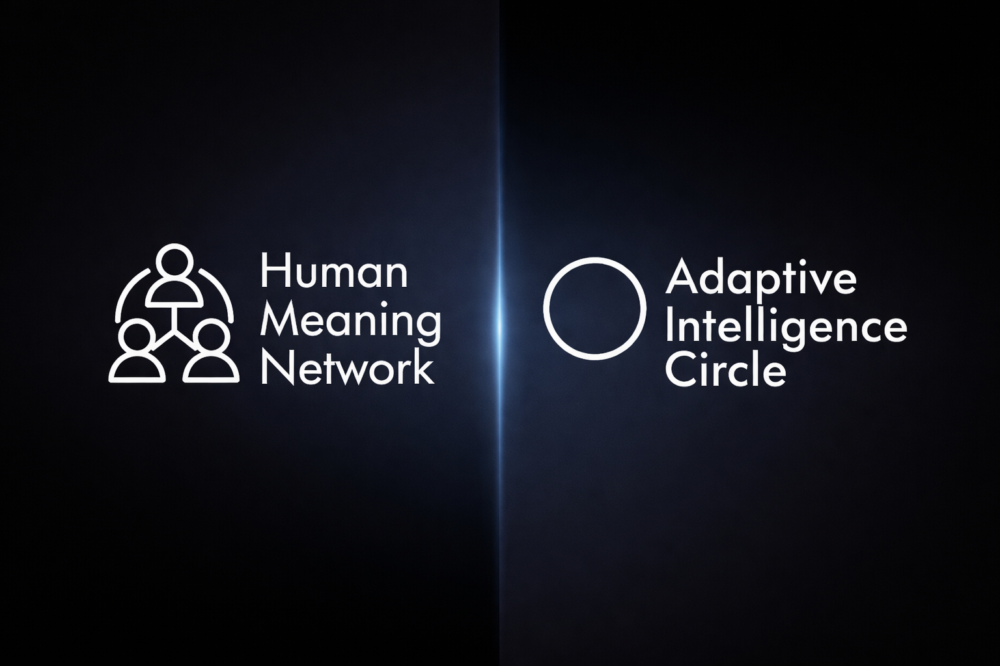

<!-- <h1 align="center">
   
  Nguyen Duc Tri
</h1> -->

<h1 align="center">
   
  Nguyen Duc Tri
</h1>

<h3 align="center">Founder of Adaptive Intelligence Circle (AIC) and Human Meaning Network (HMN) </h3>
<h4 align="center">Lead Architect of Adaptive AI • Adaptive OS • IBCS • DIP • AIForDriver</h4>

  

---

## 🌐 About Me
> *“Technology should not only adapt to humans — it should evolve with human ethics and responsibility.”*

- 🎯 **Founder** of [Adaptive Intelligence Circle (AIC)](https://github.com/AdaptiveIntelligenceCircle) — an open, global, and ethical intelligence initiative.
- 🧠 Research focus: **Adaptive AI Systems**, **Kernel-level Security**, **Distributed Reasoning Frameworks**.
- 🧩 Creator of:
  - **Adaptive AI** — self-learning, self-defensive intelligence engine  
  - **Adaptive OS** — decentralized protection and orchestration system  
  - **IBCS** — introspective behavioral compiler system  
  - **AIForDriver** — real-world adaptive intelligence  
  - **Driver Introspective Proxy** - Kernel space intelligence. 
  - **AICP** - Protocol for Adaptive Intelligence Circle.
  - **AIC-Agents/EdgeOS/Earth/DePin/Orchestration/AeroSpace**
  - **AIC-Governance/Education/Energy/Creative/Sports/Quantum/Heath**
  - **Human Meaning Network**

- 🌍 Based in Vietnam • Leading a human-centered revolution in intelligence

- 🎯 **MY ORCID** : [NguyenDucTri](https://orcid.org/0009-0007-8545-0420)
- 🎯 **Open Collective (Nguyen Duc Tri)** : [OpenCollective/NguyenDucTri](https://opencollective.com/dashboard/nguyen-duc-tri)
- 🎯 **Open Collective (AIC)**: [OpenCollective/AIC](https://opencollective.com/adaptive-intelligence-circle#category-CONNECT)
- **GitLab**: [GitLab/CodelikeC](https://gitlab.com/users/CodelikeC)
- **CodeBerg**: [NguyenDuctri_AIC](https://codeberg.org/NguyenDucTri_2004-AIC)
- **Substack**:https://substack.com/@nguynctr1
- **Spiderum**: [Spiderum/NguyenDucTriAIC/HMN](https://spiderum.com/nguoi-dung/TrifanboymarvelDc)
- **Website**: [Linkedin/AdaptiveIntelligenceCircle](https://www.linkedin.com/company/112400906/admin/page-posts/published/)
- **Youtube**: [@AdaptiveIntelligenceCircle](https://www.youtube.com/channel/UCFqAmuzpH0mrENjoAfGAj2A)
---

## 🧭 Vision & Philosophy
> Building **root-level adaptive intelligence** that unites engineering discipline, ethical responsibility, and humanistic design.

- 🔁 AIC stands for: **Autonomy • Integrity • Collaboration**  
- ⚙️ My core belief:  
  *“Complexity with purpose is better than simplicity without soul.”*

---

## 🎓 Education

- **Troy University** – Bachelor’s Program  
  Joint program with Hanoi University of Science and Technology [2022-2027]  
  - Focused on Computer Science  
  - Developed strong foundation in: 
  > software engineering, AI, distributed systems, etc.

--- 

## 🏆 Experience

- **[Project Manager]** – [**Open Collective**]  
  [Dec 2025] – [Present]  

  > Managing the AIC project’s funding and community contributions through Open Collective. Overseeing transparency, budgeting, and contributor engagement as part of the ecosystem’s governance.

- **[Open Source Developer]** – [**GitHub Inc**]  
  [Mar 2024] – [Present]  

  > Leading the development and governance of AIC and HMN projects, hosted on GitHub. Responsibilities include designing architecture, managing repositories, coordinating contributors, and ensuring transparency in open-source collaboration.

- **[Guest Speaker]** – [**The Leading Niche**]  
  [Oct 2025] – [Nov 2025]  

  > I join an Apple podcast named LeadWithAI. The host is Dr. Tamara with 25 years of experience in AI platform for business. The podcast was launched in November 2025 on multiple media : YouTube, Apple Podcast, Instagram, LinkedIn,..

  > We talk about the mission behind AIC : a non-profit open source organization of Ethical AI planetary and decentralized system.

- **[Technical Assessment Candidate]** - [**xAI** (merge with **SpaceX**)]

  [July 2025] - [July 2025]

  > Advanced to Round 2 in competitive hiring process for Software Engineering and AI Tutor roles. 
  > Demonstrated expertise in programming, AI system. Attached Data Structure and problem solving. 
  > Gained valuable insights into frontier AI research priorities and team dynamics at a leading AI organization.

--- 

## 🕰️ Mission Timeline

| Year | Milestone | Description |
|------|------------|-------------|
| **4/2025** | **Adaptive AI** | Initiated research on self-adaptive architecture & meta-learning core |
| **5/2025** | **Adaptive OS** | Designed kernel-level adaptive system & plugin infrastructure |
| **7/2025** | **IBCS** | Built the Introspective Behavioral Compiler System (Language + Runtime) |
| **8/2025** | **DIP** | Built the Driver Introspective Proxy (Kernel + Runtime + adaptive AI prototype) |
| **9/2025 (Q3)** | **AIForDriver** | Applied adaptive models in real-time autonomous systems |
| **11/2025 (Q4)** | **AIC Global Phase** | Foundation of *Adaptive Intelligence Circle* as an ethical AI movement |
| **1/2026** | **Adaptive Intelligence Network (AIN)** | Decentralized, ethical intelligence ecosystem beyond OS level |
| **1/2026 - Future** | **Human Meaning Network (HMN)** | Decentralized, non-profit network based on AIN – designed to help people discover, share, and maintain their personal meaning in a post-scarcity context |

---

## 🧩 Core Projects

| Repository | Description | Focus |
|-------------|--------------|--------|
| [Adaptive AI](https://github.com/AdaptiveIntelligenceCircle/AdaptiveAI) | Context-aware, self-learning meta architecture | Intelligence Core |
| [Adaptive OS](https://github.com/AdaptiveIntelligenceCircle/AdaptiveOS) | Decentralized, kernel-level adaptive operating system | Systems & Security |
| [IBCS](https://github.com/AdaptiveIntelligenceCircle/IBCS) | Introspective Behavioral Compiler System | Language + Reasoning |
| [AIForDriver](https://github.com/AdaptiveIntelligenceCircle/AIForDriver) | Adaptive intelligence for real-world autonomous control | Applied AI |
| [Driver Introspective Proxy](https://github.com/AdaptiveIntelligenceCircle/DriverInstrospectiveProxy) | Adaptive intelligence for kernel/Driver system autonomous control | Applied AI |
---

## 🎙️ Featured Talks / Media

> *Official Podcast Launch — 11/11/2025*

| Title | Platform | Description |
|--------|------------|-------------|
| **This AI Operating System is teaching technology to think ethically** | 🎧 *Apple Podcast Series by Dr.Tamara Nall* | A deep dive into the vision, ethics, and mission behind AIC |
| **...** | 🗣️ *Online Meeting* | Sharing how zero-capital innovation can shape ethical technology |
| **Building Adaptive OS for Humanity** | 📺 *FutureTech Asia 2026 (planned)* | Bridging AI, security, and humanistic engineering principles |

---

## 🛠️ Languages & Technologies

  

---

## 📊 Stats & Highlights

  
  

  
  

---

## 🤝 Connect with Me

  
  
  
  

---

  <i>“The revolution of intelligence begins not from machines — but from the human behind them.”</i> 
  <b>— Nguyen Duc Tri, Founder of AIC</b>

